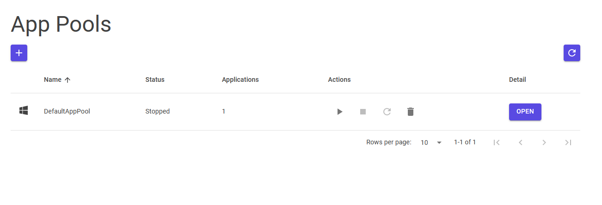
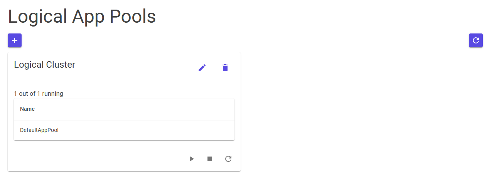

# IIS Manager
A simple Blazor Server application, which allows you to add and remove app-pools, and cluster app-pools in logical clusters.

**Important:** This software requires to be run with administrator privileges.

## App-Pools overview list

## Logical App-Pools overview list
